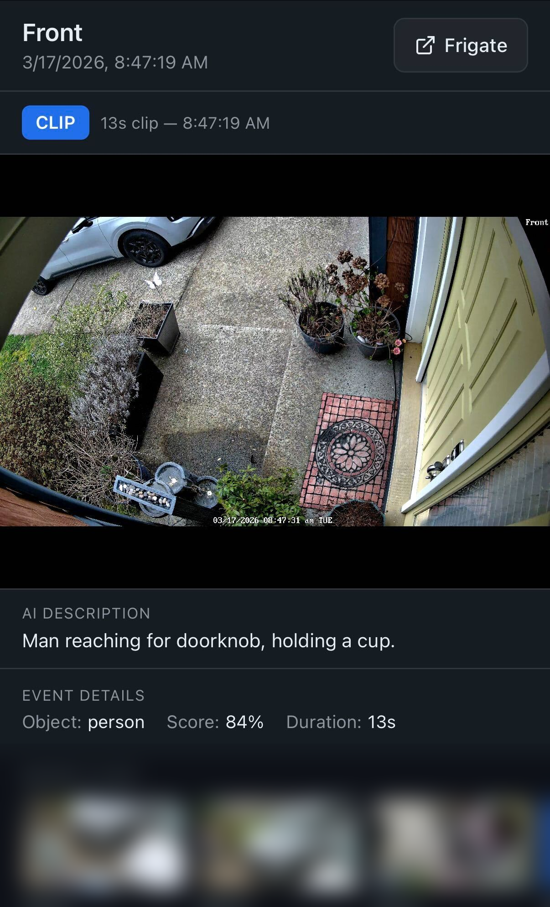

# Frigate Event Viewer

A mobile-friendly event viewer page for [Frigate NVR](https://frigate.video). Tap a notification, see the event — live stream if in progress, recorded clip if it's over.



## Features

- **Live or Clip** — shows live HLS stream for in-progress events, recorded clip for completed events
- **AI Description** — displays Frigate's GenAI description when available (polls until ready, hides if not configured)
- **Event Details** — object type, confidence score, duration, zones
- **Recent Clips** — horizontal carousel of recent review clips across all cameras
- **Cross-platform video** — native HLS → hls.js → raw MP4 fallback chain (works on iOS, Android, desktop)
- **Dark theme** — matches Frigate's UI
- **Single HTML file** — no build step, no dependencies beyond hls.js from CDN

## Installation

### Docker (recommended)

Add a volume mount to your Frigate Docker Compose file:

```yaml
services:
  frigate:
    # ... your existing config ...
    volumes:
      - /path/to/event-viewer.html:/opt/frigate/web/event-viewer.html:ro
```

Then restart Frigate:

```bash
docker compose up -d
```

The page is now available at `https://your-frigate-host/event-viewer.html`.

### URL Parameters

| Parameter | Required | Description |
|-----------|----------|-------------|
| `event_id` | Yes | Frigate event ID |
| `camera` | Yes | Camera name |
| `review_id` | No | Review ID (for "Open in Frigate" link) |

Example:
```
https://frigate.example.com/event-viewer.html?event_id=1234567890.123-abc&camera=front&review_id=xyz
```

## Home Assistant Notification Setup

Use this automation to send push notifications that link to the event viewer when Frigate detects something:

```yaml
automation:
  - alias: Frigate Camera Alerts
    mode: parallel
    max: 5
    triggers:
      - trigger: mqtt
        topic: frigate/reviews
        value_template: '{{ value_json["type"] }}~{{ value_json["after"]["severity"] }}'
        payload: new~alert
    conditions:
      - condition: template
        value_template: >-
          {{ trigger.payload_json["after"]["data"]["objects"] | length > 0 }}
    actions:
      - variables:
          camera_name: '{{ trigger.payload_json["after"]["camera"] }}'
          objects: '{{ trigger.payload_json["after"]["data"]["objects"] | sort | join(", ") | title }}'
          event_id: '{{ trigger.payload_json["after"]["data"]["detections"][0] }}'
          review_id: '{{ trigger.payload_json["after"]["id"] }}'
      - action: notify.mobile_app_YOUR_PHONE
        data:
          title: '{{ camera_name | title }} — {{ objects }}'
          message: '{{ objects }} detected at {{ now().strftime("%I:%M %p") }}'
          data:
            tag: frigate-{{ camera_name }}
            group: frigate
            entity_id: camera.{{ camera_name }}
            image: /api/frigate/notifications/{{ event_id }}/thumbnail.jpg
            actions:
              - action: URI
                title: View Event
                uri: "https://YOUR_FRIGATE_URL/event-viewer.html?event_id={{ event_id }}&camera={{ camera_name }}&review_id={{ review_id }}"
              - action: SNOOZE_5_automation.frigate_camera_alerts
                title: Snooze 5m
              - action: SNOOZE_30_automation.frigate_camera_alerts
                title: Snooze 30m
              - action: SNOOZE_60_automation.frigate_camera_alerts
                title: Snooze 1h
            url: "https://YOUR_FRIGATE_URL/event-viewer.html?event_id={{ event_id }}&camera={{ camera_name }}&review_id={{ review_id }}"
```

Replace `YOUR_PHONE` and `YOUR_FRIGATE_URL` with your values.

### AI-Enhanced Notifications

If you have GenAI configured in Frigate, you can update notifications with the AI description after it's generated. This requires a `rest_command` in your HA `configuration.yaml`:

```yaml
rest_command:
  get_frigate_event:
    url: "http://YOUR_FRIGATE_IP:5050/api/events/{{ event_id }}"
    method: GET
    content_type: "application/json"
```

Then add this after the initial notification in your automation to poll for the description and silently update the notification:

```yaml
      - repeat:
          count: 6
          sequence:
            - delay:
                seconds: 10
            - action: rest_command.get_frigate_event
              data:
                event_id: '{{ event_id }}'
              response_variable: api_response
            - variables:
                ai_description: "{{ api_response.content.data.description | default('', true) }}"
            - condition: template
              value_template: "{{ ai_description | length > 0 }}"
            - action: notify.mobile_app_YOUR_PHONE
              data:
                title: '{{ camera_name | title }} — {{ objects }}'
                message: '{{ ai_description }}'
                data:
                  tag: frigate-{{ camera_name }}
                  group: frigate
                  entity_id: camera.{{ camera_name }}
                  image: /api/frigate/notifications/{{ event_id }}/thumbnail.jpg
                  push:
                    sound: none
                    interruption-level: passive
                  actions:
                    - action: URI
                      title: View Event
                      uri: "https://YOUR_FRIGATE_URL/event-viewer.html?event_id={{ event_id }}&camera={{ camera_name }}&review_id={{ review_id }}"
                  url: "https://YOUR_FRIGATE_URL/event-viewer.html?event_id={{ event_id }}&camera={{ camera_name }}&review_id={{ review_id }}"
            - stop: "Description found"
```

### Frigate GenAI Configuration

To enable AI descriptions, add a GenAI provider to your Frigate config and enable it per camera:

```yaml
# Global GenAI provider
genai:
  provider: gemini
  api_key: "YOUR_GEMINI_API_KEY"
  model: gemini-2.5-flash

# Under objects (global or per-camera)
objects:
  track:
    - person
    - car
    - dog
    - cat
  genai:
    prompt: "Security camera {camera}. Reply with only a few words like a log entry. No full sentences."
    object_prompts:
      person: "Few words only. Start with who (man, woman, delivery driver, kid, etc), then action and items."
      car: "Few words only. Arriving/leaving/parked, color, type."
      dog: "Few words only. What is the dog doing?"
      cat: "Few words only. What is the cat doing?"

# Enable per camera
cameras:
  front:
    objects:
      genai:
        enabled: true
        use_snapshot: true
```

Get a Gemini API key at [Google AI Studio](https://aistudio.google.com/api-keys). Requires Google Cloud billing (pay-as-you-go, typically pennies/month for home use).

## How It Works

1. Page loads → shows event snapshot immediately
2. Fetches event data from Frigate API
3. **Event in progress** (`end_time` is null) → starts HLS live stream via go2rtc
4. **Event ended** → plays recorded clip via Frigate's VOD HLS endpoint
5. Polls for AI description until available (up to 60 seconds), hides section if GenAI not configured
6. Loads recent review clips in a carousel at the bottom

### Video Playback Fallback Chain

1. **Native HLS** — Safari/iOS (handles HEVC natively)
2. **hls.js** — Chrome, Firefox, Android (MSE-based, handles H.264 and HEVC on supported hardware)
3. **Raw MP4** — direct clip download as last resort

## Requirements

- Frigate 0.14+
- Docker (for volume mount installation)
- Optional: GenAI provider configured in Frigate for AI descriptions
- Optional: Home Assistant + companion app for push notifications

## License

MIT
